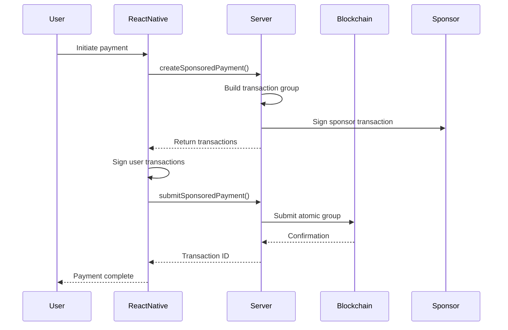

# Payment Contract Integration Guide

## Overview

The payment contract enables seamless, sponsored payments on Algorand specifically designed for business payments:
- **Payments are always TO businesses** - recipient business determined from JWT context
- **Users only sign asset transfers** - no transaction fees required  
- **Sponsor (Confío) pays all blockchain fees** on behalf of users
- **0.9% fee is automatically deducted** from payments for sustainability
- **Optional on-chain receipts** can be stored for audit trails

## Key Design Decision: Business-Only Recipients

All payments through the payment contract flow TO business accounts. The recipient business is determined from the JWT context on the server side, ensuring:
- Secure business identification without client manipulation
- Simplified payment flow (no need to specify recipient)
- Clear audit trail for business transactions

## Architecture

### Smart Contract (Algorand)
- **Contract ID**: 744210766 (TestNet)
- **Contract Address**: OBLDO2VPRXAJC2M2EVQ6LL23QS2YKY3WTLLWFOESOIJEAXRNPA3EKBKCV4
- **Supported Assets**: 
  - cUSD (744192921)
  - CONFIO (744150851)

### Server-Side (Django/GraphQL)
- **Transaction Builder**: `/blockchain/payment_transaction_builder.py`
- **GraphQL Mutations**: `/blockchain/payment_mutations.py`
- **Payment Models**: `/blockchain/models.py` (Payment, PaymentReceipt)

### Client-Side (React Native)
- **Service Layer**: `/apps/src/services/algorandService.ts`
- **GraphQL Mutations**: `/apps/src/apollo/mutations.ts`

## Payment Flow

### 1. Sponsored Payment (Recommended)



### 2. Direct Payment (User pays fees)

For cases where sponsorship is unavailable:

```javascript
// Client creates direct payment
const result = await createDirectPayment({
  recipientAddress: "ALGO_ADDRESS...",
  amount: 100,
  assetType: "CUSD"
});

// User signs ALL transactions and pays fees
```

## Server-Side Implementation

### GraphQL Mutations

#### Create Sponsored Payment (Business Recipient)
```graphql
mutation CreateSponsoredPayment(
  $amount: Float!
  $assetType: String
  $note: String
  $createReceipt: Boolean
) {
  createSponsoredPayment(
    # Recipient business determined from JWT context
    amount: $amount
    assetType: $assetType
    note: $note
    createReceipt: $createReceipt
  ) {
    success
    error
    transactions        # Array of transactions to sign
    userSigningIndexes  # Which ones user must sign
    groupId
    grossAmount        # Amount user pays
    netAmount          # Amount business receives (after 0.9% fee)
    feeAmount          # 0.9% fee amount
    paymentId
  }
}
```

#### Submit Sponsored Payment
```graphql
mutation SubmitSponsoredPayment(
  $signedTransactions: JSONString!
  $paymentId: String
) {
  submitSponsoredPayment(
    signedTransactions: $signedTransactions
    paymentId: $paymentId
  ) {
    success
    error
    transactionId
    confirmedRound
  }
}
```

### Python Example (Server)

```python
from blockchain.payment_transaction_builder import PaymentTransactionBuilder

# Initialize builder
builder = PaymentTransactionBuilder(network='testnet')

# Build sponsored payment
transactions, user_signing_indexes = builder.build_sponsored_payment(
    sender_address="USER_ALGO_ADDRESS",
    recipient_address="RECIPIENT_ALGO_ADDRESS",
    amount=100_000_000,  # 100 cUSD in base units
    asset_id=744192921,  # cUSD
    payment_id="unique-payment-id",
    note="Payment for services"
)

# Sponsor signs their transaction(s)
# User only signs transactions at user_signing_indexes
```

## Client-Side Implementation

### React Native Integration

```typescript
// Using the AlgorandService
import { algorandService } from './services/algorandService';

// Payment to business (recipient determined by JWT on server)
const txId = await algorandService.sponsoredPaymentToBusiness(
  amount,            // Amount in whole units
  'CUSD',           // Asset type: 'CUSD' or 'CONFIO'
  {
    note: 'Payment for services',
    createReceipt: true  // Store receipt on-chain
  }
);

// The JWT context must include:
// - sender account (personal or business)
// - recipient_business_id (which business receives payment)
```

### Using Apollo Client Directly

```typescript
import { useMutation } from '@apollo/client';
import { CREATE_SPONSORED_PAYMENT, SUBMIT_SPONSORED_PAYMENT } from '../apollo/mutations';

function PaymentComponent() {
  const [createPayment] = useMutation(CREATE_SPONSORED_PAYMENT);
  const [submitPayment] = useMutation(SUBMIT_SPONSORED_PAYMENT);
  
  const handlePaymentToBusiness = async () => {
    // Step 1: Create payment (recipient from JWT)
    const { data } = await createPayment({
      variables: {
        amount: 100,
        assetType: "CUSD",
        note: "Payment for order #123",
        createReceipt: true
      }
    });
    
    if (!data.createSponsoredPayment.success) {
      throw new Error(data.createSponsoredPayment.error);
    }
    
    // Step 2: Sign transactions that need user signature
    const signedTxns = [];
    for (const txn of data.createSponsoredPayment.transactions) {
      if (txn.needs_signature) {
        const signed = await algorandService.signTransactionBytes(
          Buffer.from(txn.transaction, 'base64')
        );
        signedTxns.push({
          index: txn.index,
          transaction: Buffer.from(signed).toString('base64')
        });
      } else {
        signedTxns.push(txn);
      }
    }
    
    // Step 3: Submit signed transactions
    const submitResult = await submitPayment({
      variables: {
        signedTransactions: JSON.stringify(signedTxns),
        paymentId: data.createSponsoredPayment.paymentId
      }
    });
    
    console.log('Payment confirmed:', submitResult.data.submitSponsoredPayment.transactionId);
  };
}
```

## Fee Structure

- **Contract Fee**: 0.9% of payment amount
- **Blockchain Fees**: Paid by sponsor (not user)
- **Minimum Balance**: Users need 0.1 ALGO per asset opt-in

### Fee Calculation Example
```
User sends: 100 cUSD
Contract fee: 0.9 cUSD (0.9%)
Recipient gets: 99.1 cUSD
Blockchain fees: ~0.002 ALGO (paid by sponsor)
```

## Receipt Storage

When `createReceipt: true`, the contract stores a receipt on-chain:

```python
# Receipt structure in contract box storage
{
  "payment_id": "uuid",
  "sender": "ALGO_ADDRESS",
  "recipient": "ALGO_ADDRESS", 
  "amount": 100000000,
  "net_amount": 99100000,
  "fee": 900000,
  "timestamp": 1234567890
}
```

## Error Handling

### Common Errors

1. **"You need to opt into CUSD before sending"**
   - User hasn't opted into the asset
   - Solution: Call opt-in mutation first

2. **"Insufficient CUSD balance"**
   - User doesn't have enough tokens
   - Solution: Check balance before payment

3. **"balance X below min Y"**
   - Account needs more ALGO for minimum balance
   - Solution: Fund account with ALGO

## Testing

### TestNet Configuration
```bash
# Environment variables
ALGORAND_NETWORK=testnet
ALGORAND_PAYMENT_APP_ID=744210766
ALGORAND_CUSD_ASSET_ID=744192921
ALGORAND_CONFIO_ASSET_ID=744150851
ALGORAND_SPONSOR_ADDRESS=PFFGG74A3BTBMPOJSTJALIIF4PO3JQJCS3WKYYXDQQ73J35EG2QOSCQRSY
ALGORAND_ADMIN_MNEMONIC="your 25 words..."
```

### Test Payment Flow
```bash
# 1. Deploy/setup contract (strict + verified)
make deploy-payment

# 2. Test server-side
python manage.py shell
>>> from blockchain.payment_transaction_builder import PaymentTransactionBuilder
>>> builder = PaymentTransactionBuilder()
>>> # Test transaction building

# 3. Test client-side
# Use React Native app to initiate payment
```

## Security Considerations

1. **Never expose sponsor private key** to client
2. **Always validate recipient addresses** on server
3. **Implement rate limiting** for payment mutations
4. **Store payment records** in database for audit
5. **Monitor sponsor balance** and alert on low funds

## Monitoring

Track these metrics:
- Payment success rate
- Average fee collected
- Sponsor balance remaining
- Failed transaction reasons
- Payment volume by asset type

## Future Enhancements

1. **Batch payments** - Send to multiple recipients
2. **Scheduled payments** - Recurring transactions
3. **Multi-asset swaps** - Convert during payment
4. **Fee customization** - Variable fee rates
5. **Payment links** - Shareable payment requests
