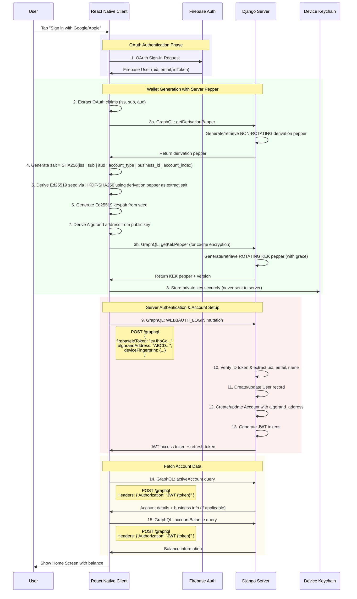

# Algorand Sign-In Flow: Client-Server Architecture

## Overview
Sign-in process using Firebase Auth + Deterministic Algorand Wallet generation

## Complete Sign-In Flow



## Why ID Token is Sufficient

The Firebase ID Token contains everything the server needs:

- **Firebase UID**: Extracted during token verification
- **Email**: In the token claims
- **Name**: In the token claims (if available)
- **OAuth Claims**: For wallet generation (iss, sub, aud)

When the server verifies the ID token using Firebase Admin SDK:
```python
decoded_token = auth.verify_id_token(id_token)
firebase_uid = decoded_token['uid']  # No need to send separately
email = decoded_token.get('email')
name = decoded_token.get('name')
# OAuth claims for wallet generation
issuer = decoded_token.get('iss')
subject = decoded_token.get('sub')
audience = decoded_token.get('aud')
```

Therefore, sending `web3AuthId`, `email`, `firstName`, `lastName` separately is redundant!

## Request Summary

### Total HTTP Requests: 5

1. **Firebase OAuth** (1 request)
   - Method: OAuth flow (handled by Firebase SDK)
   - Endpoint: Firebase Auth servers
   - Purpose: Authenticate with Google/Apple

2. **Get Wallet Pepper** (1 request)
   - Method: `POST /graphql`
   - Purpose: Get server pepper for wallet generation
   - Request Body:
   ```graphql
   query GetWalletPepper {
     getWalletPepper(scope: "oauth_subject_123") {
       pepper
       expiresAt
     }
   }
   ```

3. **WEB3AUTH_LOGIN Mutation** (1 request)
   - Method: `POST /graphql`
   - Purpose: Register/login user with Algorand address
   - Optimized Request Body:
   ```graphql
   mutation Web3AuthLogin {
     web3AuthLogin(
       firebaseIdToken: "eyJhbGc..."  # Firebase ID Token (contains all needed info)
       algorandAddress: "ALGORAND_ADDRESS_HERE"
       deviceFingerprint: "{...}"
     ) {
       success
       accessToken
       refreshToken
       user {
         id
         email
         algorandAddress
       }
     }
   }
   ```
   
   Note: The `provider` can also be extracted from the ID token's `firebase.sign_in_provider` claim, making it optional

4. **Active Account Query** (1 request)
   - Method: `POST /graphql`
   - Purpose: Get account details
   - Headers: `Authorization: JWT {access_token}`
   - Request Body:
   ```graphql
   query GetActiveAccount {
     activeAccount {
       id
       accountType
       accountIndex
       algorandAddress
       business {
         id
         name
         category
       }
     }
   }
   ```

5. **Account Balance Query** (1 request)
   - Method: `POST /graphql`
   - Purpose: Get current balance
   - Headers: `Authorization: JWT {access_token}`
   - Request Body:
   ```graphql
   query GetAccountBalance {
     accountBalance {
       usdc
       cusd
       confio
     }
   }
   ```

## Client-Side Only Operations (No Network Requests)

These operations happen entirely on the device:

1. **OAuth claim extraction** - Parse JWT from Firebase
2. **Salt generation** - SHA256(issuer | subject | audience | account_type | business_id | account_index)
3. **Seed derivation** - HKDF-SHA256 with extract salt = H(derivationPepper)
4. **Keypair generation** - Ed25519 from seed
5. **Address derivation** - Algorand address from public key
6. **Private key storage** - Secure storage in device Keychain

## Wallet Generation Formula

The deterministic wallet generation uses two components:

### 1. Salt (Client-Generated)
```
salt = SHA256(issuer | subject | audience | account_type | business_id | account_index)
```
Where (extracted from Firebase ID Token claims):
- `issuer`: OAuth provider (e.g., "https://accounts.google.com")
- `subject`: OAuth subject ID from the ID token (e.g., "117...823" for Google)
  - NOTE: This is different from Firebase UID
  - Firebase UID: Firebase's internal user ID (e.g., "Xw2aZ9kQ...")
  - OAuth Subject: Google/Apple's user ID (e.g., "117...823")
- `audience`: OAuth audience/client ID (e.g., "730...apps.googleusercontent.com")
- `account_type`: "personal" or "business"
- `business_id`: Business ID (only for business accounts, empty for personal)
- `account_index`: Account index (0, 1, 2, etc.)

### 2. Peppers (Server-Provided)
- Derivation Pepper: 32-byte random per account, NON-ROTATING. API: `getDerivationPepper`
- KEK Pepper: 32-byte random per account, ROTATING with grace. API: `getKekPepper`

### 3. Final Seed Calculation
```
seed = HKDF-SHA256(IKM=`confio-wallet-v1|${salt}`,
                   salt=`confio/extract/v1|${derivationPepper}`,
                   info=`confio/algo/v1|...`)
keypair = Ed25519.fromSeed(seed)
algorandAddress = encodeAddress(keypair.publicKey)
```

## Server Pepper Systems

Two peppers with separate purposes and policies:
- **Derivation**: Non-rotating per account. Used in salt to define the address. Never rotates.
- **KEK**: Rotating per account. Used for encrypting cached seeds. Grace period supports re-wrapping.

## Key Differences from zkLogin

### Old zkLogin Flow (Removed)
- Required 6+ requests including prover service
- Server-side proof generation
- Complex ephemeral key management
- Dependency on external prover infrastructure

### New Algorand Deterministic Flow
- Only 5 requests total (including pepper fetch)
- All cryptographic operations client-side
- Deterministic: same OAuth identity = same Algorand address
- No external dependencies beyond Firebase Auth

## Security Considerations

1. **Private Keys**: Never leave the device, stored in Keychain
2. **Server Pepper**: Ensures wallets can't be generated without server involvement
3. **Algorand Address**: Deterministically generated with pepper, sent to server for reference only
4. **JWT Tokens**: Used for all authenticated requests after sign-in
5. **Device Fingerprinting**: Helps detect suspicious activity

## Multi-Account Support

When switching accounts, the client:
1. Uses cached pepper (or fetches if missing)
2. Regenerates salt with new account context (account_type, business_id, account_index)
3. Derives seed via HKDF-SHA256 using the client salt
4. Derives new keypair and Algorand address
5. No additional server requests if pepper is cached

## Subsequent Sessions

On app restart with existing session:
1. Check for valid JWT in Keychain (0 requests)
2. If expired, refresh token (1 request)
3. Check pepper cache, fetch if expired (0-1 requests)
4. Regenerate Algorand wallet from OAuth claims + pepper (0 requests, deterministic)
5. Fetch latest balance (1 request)

Total: 1-3 requests for returning users

## Performance Metrics

- **Initial Sign-In**: ~2-3 seconds total
  - Firebase OAuth: 1-2s
  - Wallet generation: <100ms
  - Server registration: 500ms
  - Balance fetch: 500ms

- **Account Switching**: <200ms (client-side only)
- **Session Restore**: <1s (with balance fetch)
